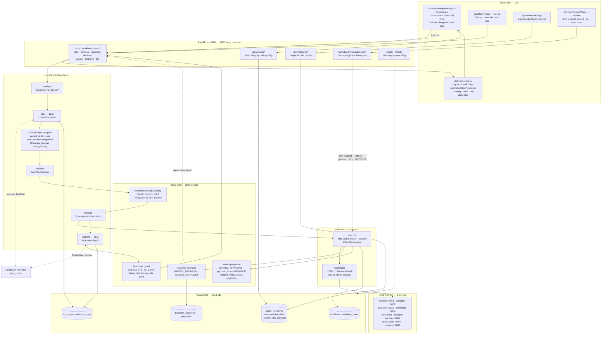
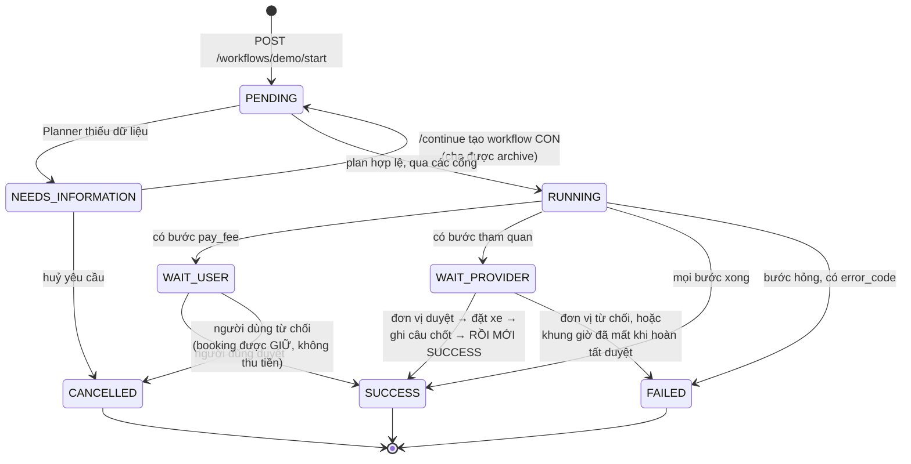
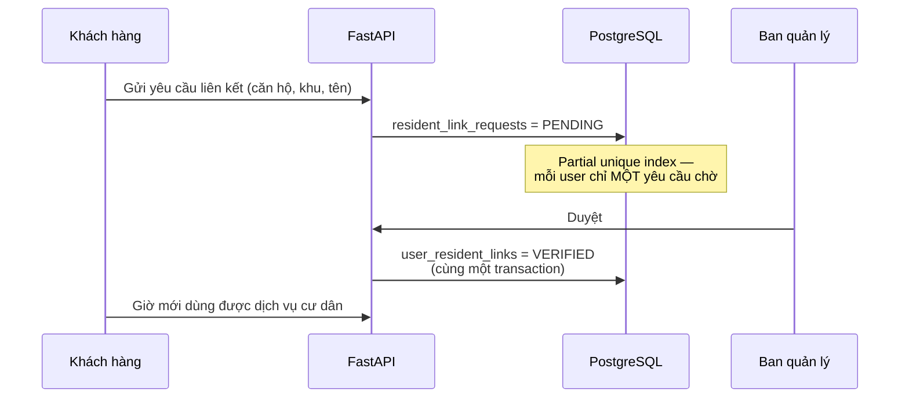
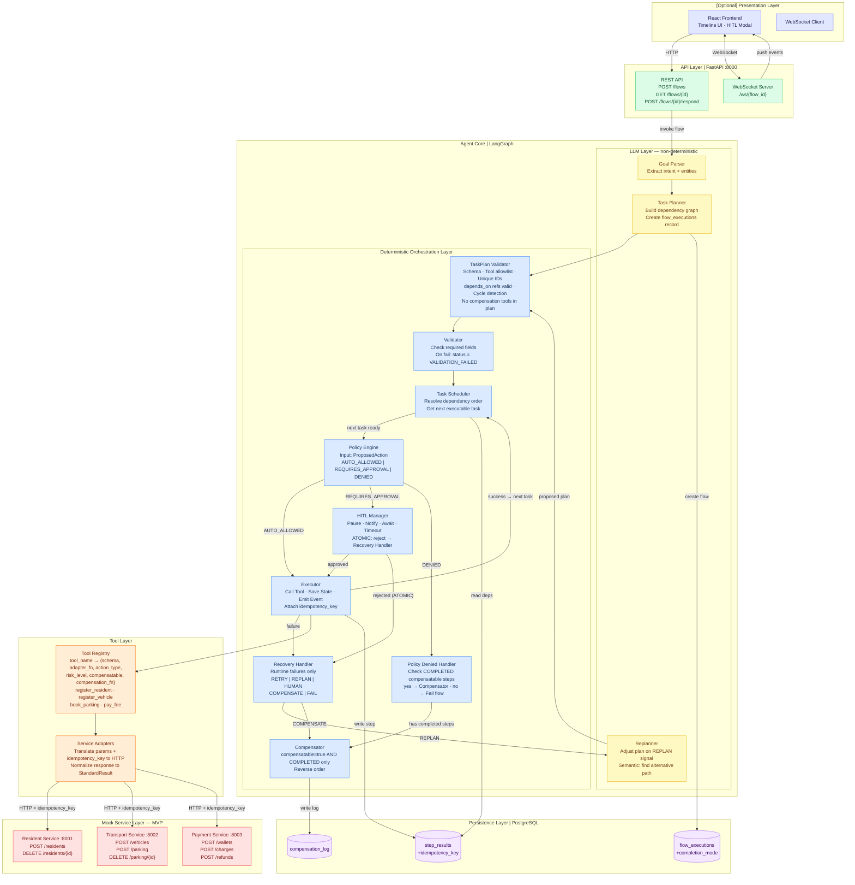
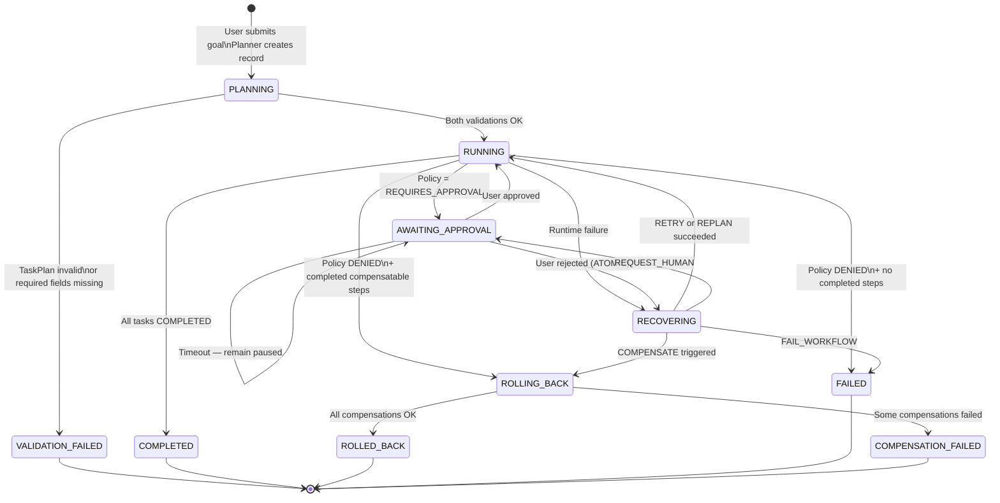
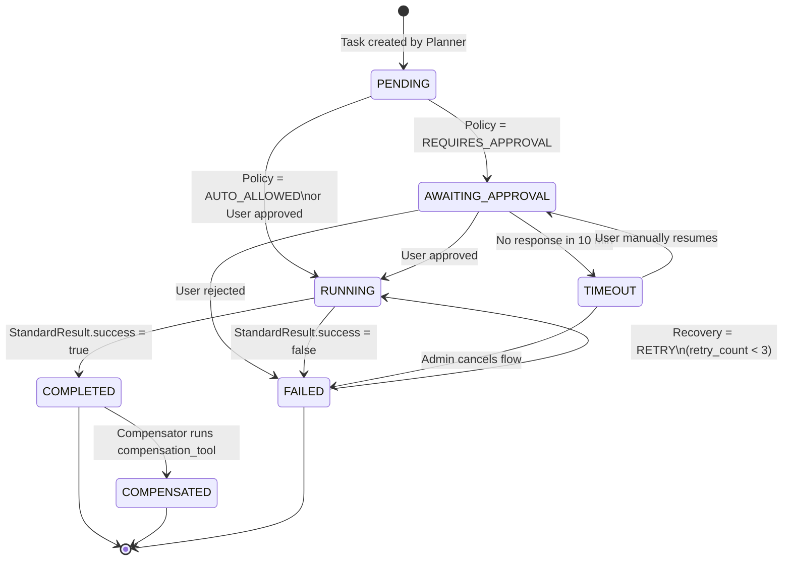

# Architecture Diagram — P-118

**Đề tài:** AI Agent orchestrate đa dịch vụ hoàn thành tác vụ liên hoàn (đặt nhà → xe → dịch vụ)

**Mã đề tài:** PTNT-02 — STT 158

**Stack:** LangGraph · FastAPI · PostgreSQL · React
**Cập nhật:** 16/08/2026

---

> **Đọc tài liệu này thế nào**
>
> Nó có hai phần, và trộn hai phần lại là cách nhanh nhất để hiểu sai hệ thống:
>
> | Phần | Nội dung | Trạng thái |
> |---|---|---|
> | **A. Kiến trúc as-built (Gate 2)** | Đúng thứ đang chạy trong `src/` | Đã xây, chạy được end-to-end |
> | **B. Thiết kế mục tiêu (Gate 1)** | Policy Engine, HITL Manager, Saga Compensator, WebSocket | **Chưa xây** — là roadmap |
>
> Phần B viết ngày 31/07 và giữ nguyên làm định hướng. Những gì nó mô tả mà
> phần A không có thì **chưa tồn tại trong code**. Ví dụ: hệ thống hiện dùng
> polling chứ không WebSocket, có cổng duyệt thanh toán chứ chưa có Policy
> Engine tổng quát, và chưa có Compensator trong đường chạy thật.

---

# PHẦN A — Kiến trúc as-built (Gate 2)

## A1. Data flow đầy đủ



## A2. Hai chỗ dùng LLM, và ranh giới của chúng

Toàn bộ `src/agents/` **không có một dòng nào** chạm database: không `asyncpg`,
không `repository`, không `SELECT`. LLM không có tool đọc DB, không gọi HTTP tới
provider. Mọi dữ liệu nó thấy đều do backend lọc rồi đưa vào.

| | Planner | Response Agent |
|---|---|---|
| File | `src/agents/planner.py` | `src/agents/response_agent.py` |
| Nhận | `goal` + `existing_context` | `ReplyView` (đã lọc) |
| Trả | `TaskPlan` hoặc `missing_fields` | `answer` + tối đa 3 gợi ý |
| Không được | soạn câu hỏi cho người dùng, thực thi bất cứ gì | đổi trạng thái, đổi số tiền |

`_PlannerResponse` và `ReplyView` đều có `extra="forbid"` — model thêm field lạ
là Pydantic ném ngay, không lọt vào hệ thống.

### Câu trả lời bổ sung THẮNG văn bản goal cũ

Khi người dùng đáp một câu hỏi bổ sung ("Khu B" sau khi Khu A hết chỗ), giá trị
ấy được ép đè lên kế hoạch bằng **code**, không nhờ model đọc lại:

```
POST /continue {"fields": {"parking_zone": "ZONE_B"}}
  → _extract_structured_follow_up_answers  (nhận thẳng giá trị đã đúng enum)
  → job["user_answers"]
  → AgentState.user_answers          ← PHẢI khai trong TypedDict
  → _apply_user_answers(plan, ...)   ← đè lên giá trị Planner suy từ goal
```

`AgentState` là TypedDict của LangGraph, và **LangGraph loại bỏ mọi khoá không
được khai báo**. Thiếu một dòng khai `user_answers`, cả chuỗi trên vẫn chạy
không lỗi ở đâu cả và plan node đọc ra một dict rỗng — mọi câu trả lời bổ sung
bị bỏ im lặng, Planner lập lại kế hoạch từ goal cũ, và lượt chạy lại hỏng y hệt
lượt trước.

Hai giới hạn cố ý của `_apply_user_answers`: chỉ đè khi task ĐÃ CÓ field đó
(thêm field mới là sửa kế hoạch, không phải sửa giá trị), và không bao giờ ghi
đè `InputRef` — làm vậy cắt đứt dây chuyền dữ liệu giữa các bước.

## A3. Bảy cổng chặn, theo thứ tự đi qua

| # | Cổng | File | Chặn gì |
|---|---|---|---|
| 1 | Tool allowlist | `agents/validator.py` | Đúng 9 tool, không hơn |
| 2 | Tool Contract | `common/tool_contract.py` | Kiểu, enum, khung giờ, trần ngày |
| 3 | TaskPlanValidator | `agents/validator.py` | URL/credential, chu trình, InputRef ngoài `depends_on` |
| 4 | Lọc câu hỏi | `agents/graph.py` | ID nội bộ không bao giờ thành câu hỏi cho người dùng |
| 5 | ResidentAccessBoundary | `orchestration/demo_service.py` | Quyền cư dân; `resident_id` do LLM sinh bị từ chối |
| 6 | Payment approval | `orchestration/payment_approval.py` | Không đồng nào đi trước khi người dùng bấm duyệt |
| 7 | Viewing approval | `orchestration/viewing_approval.py` | Lịch tham quan chỉ thành thật khi ĐƠN VỊ duyệt |
| 8 | Response guard | `agents/response_agent.py` | Lộ nội bộ, bịa số, khẳng định đã xong khi chưa |

### `approval_actor` — ai đang cần hành động

`WAITING_APPROVAL` nói "đang chờ duyệt" nhưng **không** nói ai duyệt, và hai
người duyệt khác nhau là hai màn hình khác nhau. Response mang thêm
`approval_actor`:

| Giá trị | Ai quyết | Giao diện |
|---|---|---|
| `USER` | chủ workflow | "Chờ bạn" + nút Xác nhận / Từ chối |
| `PROVIDER` | đơn vị dịch vụ | "Đang chờ đơn vị" — **không có nút** |
| `ADMIN` | ban quản lý | "Đang chờ ban quản lý" |

Trước khi có trường này, giao diện phải ĐOÁN bằng cách xem `payment_quote` hay
`viewing_approval` khác null. Suy diễn ấy đúng với đúng hai loại chờ đang có và
sai ngay khi xuất hiện loại thứ ba — mà cái giá của việc sai là dựng nút "Xác
nhận" cho một quyết định người dùng không có quyền ra.

### Danh mục năng lực ≠ danh sách tool

`_CAPABILITY_CATALOGUE` là thứ NGƯỜI DÙNG chọn được; `ALLOWED_TOOLS` là thứ hệ
thống chạy được. Hai cái không bằng nhau, và cố tình như vậy:

| Tool | Có trong catalogue? | Vì sao |
|---|---|---|
| `book_shuttle` | **không** | cần `viewing_id` — chỉ tồn tại sau khi có lịch. Là mục riêng thì người chưa đặt lịch chọn vào ngõ cụt. Planner tự thêm task khi khách nói cần xe đón. |
| `pay_fee` | **không** | trả phí là bước xác nhận trong luồng đặt chỗ, không phải việc đi tìm từ menu. |

UX tích hợp, kiến trúc vẫn tách tool.

### Chạy lại được là một yêu cầu, không phải may mắn

Mỗi câu trả lời bổ sung khiến backend lập lại kế hoạch **từ đầu** và gọi lại
những tool đã chạy thành công ở lượt trước. Nên các tool ghi dữ liệu phải bất
biến với chính chủ: `register_vehicle` đăng ký lại biển của mình trả về đúng xe
cũ thay vì báo trùng. Biển của **người khác** vẫn xung đột — trả xe của người
khác ra là rò rỉ dữ liệu, không phải tiện lợi.

Nguyên tắc chung: **LLM đề xuất, code quyết định.** Ba thứ quan trọng nhất đều
không đi qua model — quyền đến từ mapping đã xác minh trong PostgreSQL, số tiền
đến từ provider qua `InputRef`, và `project_id` do Validator tra từ danh mục.

## A4. Vòng đời một workflow



`WAIT_USER` và `WAIT_PROVIDER` là **cùng một status** `WAITING_APPROVAL`, phân
biệt bằng `approval_actor` (xem A3). Không phát minh trạng thái mới cho mỗi loại
chờ: thêm status là thêm một giá trị mà mọi nơi đọc status phải học.

Trạng thái kết thúc là kết thúc: không có đường quay lại `RUNNING`. Một
workflow bị bỏ dở quá TTL được sweeper đánh dấu `FAILED` kèm mã lỗi, không nằm
`PENDING` vĩnh viễn.

### Thứ tự ghi khi đơn vị duyệt — không được đảo

```
đơn vị bấm Duyệt
  → materialize lịch qua Tour provider
  → Executor chạy nốt DAG (finalize=False — KHÔNG tự chốt SUCCESS)
  → ghi kết quả nghiệp vụ vào workflow_tasks
  → sinh + ghi câu trả lời cuối (assistant_for_status = SUCCESS)
  → RỒI MỚI update_workflow_status(SUCCESS)
```

Đảo hai bước cuối tạo ra một khoảng — dài bằng một nhịp poll — mà workflow đã
xong còn câu người dùng đọc vẫn là câu của lúc chờ. Đo được trong database trước
khi sửa: `status = SUCCESS` nhưng `assistant_for_status = WAITING_APPROVAL`, và
khách đọc "Đơn vị tour đang xác nhận lịch" cho một việc đã hoàn tất. Bất biến này
được giữ bằng test (`finalize is False` trong `test_viewing_approval_routes.py`).

### Vòng đời hàng chờ duyệt

`AWAITING → APPROVED | REJECTED | EXPIRED`. `EXPIRED` **không phải** quyết định
của con người nên nó tách khỏi `REJECTED`: yêu cầu quá ngày tự rời hàng chờ khi
cổng `/review` tải danh sách. Không xoá dòng nào — bằng chứng ai yêu cầu gì vẫn
giữ nguyên.

## A5. Luồng liên kết căn hộ — nằm NGOÀI agent

Đây là quyết định kiến trúc có chủ ý: cấp quyền cư dân **không** đi qua LLM.



`register_resident` và các tool liên kết bị chặn khỏi TaskPlan
(`ResidentLinkingOutsideAgentError`) — LLM không có đường nào tự cấp quyền cho
người dùng.

## A6. Quan sát được

| Kênh | Nội dung | Bật thế nào |
|---|---|---|
| `llm_usage` (bảng) | stage, token, độ trễ mỗi lần gọi | luôn bật |
| `p118.llm.trace` (stdout) | plan quyết gì · tác vụ nào hỏng vì sao · câu trả lời | `P118_LLM_TRACE=1` |
| `/ready` | cấu hình LLM · DB · migration · 7 connector | luôn bật |
| `execution_logs` | vết chạy từng bước | luôn bật |
| Tự duyệt lịch tham quan | bỏ qua bước chờ đơn vị sau N giây | `P118_AUTO_APPROVE_VIEWING_SECONDS=30` |

Tự duyệt là **tiện ích demo, mặc định TẮT**. Bật lên nghĩa là mọi lịch tham quan
đều được chấp thuận mà không ai xem — trong hệ thống thật đó là bỏ hẳn một bước
kiểm soát. Nó đi qua ĐÚNG `resume_viewing_after_approval` mà đơn vị dùng, và ghi
`decided_by = "auto-demo"` để nhìn vào database là biết quyết định do máy đưa ra.

`llm_usage` cố ý **không** lưu prompt hay câu trả lời: nó nằm trong DB nghiệp vụ,
và prompt mang dữ liệu người dùng. Muốn xem nội dung thì dùng trace ra stdout.

---

# PHẦN B — Thiết kế mục tiêu (Gate 1, 31/07/2026)

> Phần dưới đây là **định hướng**, không phải mô tả code hiện tại. Đối chiếu với
> phần A trước khi dùng nó để hiểu hệ thống.

## Core Contribution

Hệ thống này KHÔNG phải là "LLM gọi nhiều API".
Giá trị cốt lõi nằm ở **7 thành phần**:

| #   | Thành phần                      | Vai trò                                                           |
| --- | ------------------------------- | ----------------------------------------------------------------- |
| 1   | **Goal Planning**               | LLM hiểu mục tiêu, tạo dependency graph                           |
| 2   | **Multi-service Orchestration** | Deterministic scheduler chạy đúng thứ tự phụ thuộc                |
| 3   | **Policy Control**              | Rule-based engine quyết định auto/approval/deny trước khi execute |
| 4   | **HITL**                        | Dừng flow, lấy approval từ người dùng trước khi thực thi action   |
| 5   | **Failure Recovery**            | Retry / Replan / Human trước khi chạm đến Compensate              |
| 6   | **Saga Compensation**           | Rollback đúng thứ tự ngược, chỉ với step có side effect           |
| 7   | **Persistent State**            | Toàn bộ trạng thái sống trong DB — resume/audit được              |

---

## Diagram 1 — System Architecture



### Mô tả các thành phần

#### [Optional] Presentation Layer

| Component            | Trách nhiệm                                                                                          |
| -------------------- | ---------------------------------------------------------------------------------------------------- |
| **React Frontend**   | Hiển thị timeline realtime, render HITL modal với thông tin chi phí, trigger approve/reject qua REST |
| **WebSocket Client** | Lắng nghe events từ server; tự reconnect và sync lại state qua REST khi mất kết nối                  |

#### API Layer

| Component            | Trách nhiệm                                                                             |
| -------------------- | --------------------------------------------------------------------------------------- |
| **REST API**         | Tạo flow, query trạng thái, nhận phản hồi HITL từ user; validate JWT trên mọi request   |
| **WebSocket Server** | Duy trì persistent connection theo `flow_id`; broadcast state-change events từ Executor |

#### LLM Layer — non-deterministic

| Component        | Trách nhiệm                                                                                                                                                                                                                                                                 |
| ---------------- | --------------------------------------------------------------------------------------------------------------------------------------------------------------------------------------------------------------------------------------------------------------------------- |
| **Goal Parser**  | Dùng LLM extract structured intent từ câu tiếng Việt: `{goal_type, apartment_id, user_info}`                                                                                                                                                                                |
| **Task Planner** | Dùng LLM tạo dependency graph: `{tasks: [{id, tool, depends_on, input_mapping, estimated_cost}]}`. Tạo `flow_executions` record với status `PLANNING`                                                                                                                       |
| **Replanner**    | Nhận tín hiệu `REPLAN` từ Recovery Handler kèm context (bước nào đã COMPLETED, bước nào failed và lý do). Dùng LLM reasoning để tạo lại plan cho các bước còn lại — ví dụ: "Parking Zone A unavailable → thử Zone B". **Không bao giờ thay đổi plan của bước đã COMPLETED** |

#### Deterministic Orchestration Layer

| Component                 | Trách nhiệm                                                                                                                                                                                                                                                     |
| ------------------------- | --------------------------------------------------------------------------------------------------------------------------------------------------------------------------------------------------------------------------------------------------------------- |
| **TaskPlan Validator**    | Kiểm tra plan từ LLM trước khi Scheduler nhận. Gồm: schema validation, tool allowlist check (chỉ 4 tool cho phép), unique task IDs, depends_on hợp lệ, phát hiện cyclic dependency, từ chối compensation tool trong plan. Nếu fail → flow = `VALIDATION_FAILED` |
| **Validator**             | Kiểm tra required user fields (apartment_id, cccd, phone). Nếu thiếu: set `flow.status = VALIDATION_FAILED`. Flow record vẫn tồn tại trong DB để audit                                                                                                          |
| **Task Scheduler**        | Topological sort dependency graph. Trả task tiếp theo có tất cả `depends_on` = COMPLETED. Emit SUCCESS khi không còn PENDING task                                                                                                                               |
| **Policy Engine**         | Nhận `ProposedAction`, áp dụng 5 hardcoded rule, trả `AUTO_ALLOWED / REQUIRES_APPROVAL / DENIED`. Không dùng LLM                                                                                                                                                |
| **Policy Denied Handler** | Xử lý kết quả DENIED từ Policy Engine — **không phải Runtime Recovery**. Kiểm tra có COMPLETED compensatable step nào không: có → gọi Compensator; không có → kết thúc flow FAILED trực tiếp                                                                    |
| **HITL Manager**          | Set step = `AWAITING_APPROVAL`, push `ProposedAction` qua WebSocket, đợi response. Timeout 10 phút → giữ paused. Khi user reject: chuyển sang Recovery Handler (MVP = ATOMIC — không có PARTIAL_ALLOWED logic)                                                  |
| **Executor**              | Tạo `idempotency_key = "{flow_id}-{task_id}-{tool_name}"`, gọi Tool Registry, nhận `StandardResult`, ghi `step_results`, emit WebSocket event. Chỉ đọc `result.success` (boolean)                                                                               |
| **Recovery Handler**      | **Chỉ xử lý runtime failures** (TIMEOUT, SERVICE_UNAVAILABLE, NO_AVAILABILITY, v.v.). Lookup `(error.code, retryable, retry_count)` → strategy. Không xử lý Policy outcome                                                                                      |
| **Compensator**           | Query `step_results WHERE compensatable=true AND status=COMPLETED ORDER BY completed_at DESC`. Chỉ step COMPLETED mới có side effect cần undo. Step FAILED không có gì để compensate                                                                            |

#### Tool Layer

| Component            | Trách nhiệm                                                                                                                                                                                                                                                    |
| -------------------- | -------------------------------------------------------------------------------------------------------------------------------------------------------------------------------------------------------------------------------------------------------------- |
| **Tool Registry**    | Dict `{tool_name: ToolEntry}`. Mỗi entry chứa: `schema` (typed input), `adapter_fn` (gọi thẳng Adapter), `action_type`, `risk_level`, `compensatable`, `compensation_fn`. Executor gọi `registry.execute(tool_name, params, idempotency_key)` — không biết URL |
| **Service Adapters** | Translate typed params + `idempotency_key` → HTTP request. Nhận native response → normalize → `StandardResult`. **Layer duy nhất thay đổi khi chuyển mock → real API**                                                                                         |

> **Không có Service Tool runtime layer riêng.** Tool metadata (schema, action_type, compensation_fn) sống trong Tool Registry entry. Runtime call path: `Executor → Registry → Adapter → Mock Service`.

#### Mock Service Layer (MVP — 3 services)

| Service               | Port  | Endpoints                         | Compensation endpoint                           |
| --------------------- | ----- | --------------------------------- | ----------------------------------------------- |
| **Resident Service**  | :8001 | `POST /residents`                 | `DELETE /residents/{id}`                        |
| **Transport Service** | :8002 | `POST /vehicles`, `POST /parking` | `DELETE /vehicles/{id}`, `DELETE /parking/{id}` |
| **Payment Service**   | :8003 | `POST /wallets`, `POST /charges`  | `POST /refunds`                                 |

Mock Service lưu `{idempotency_key → response}` trong memory dict. Nếu nhận request với key đã tồn tại → trả lại response cũ, không tạo transaction mới.

> **Healthcare giữ ở Extension/Scenario 2.** Không thêm service nào khác vào MVP.

---

## Diagram 2 — Agent Flow

```mermaid
flowchart TD
    START(["START\nUser submits goal"])

    PARSER_NODE["Goal Parser\n─────────────\nLLM: extract intent + entities\nfrom Vietnamese input"]

    PLANNER_NODE["Task Planner\n─────────────\nLLM: propose dependency graph\nT1 depends_on=[]\nT2 depends_on=[T1] ...\nCreate flow_executions\nstatus = PLANNING"]

    PLAN_VAL_NODE["TaskPlan Validator\n─────────────\nDeterministic:\nSchema validation\nTool allowlist: only 4 allowed tools\nUnique task IDs\ndepends_on refs valid IDs\nCycle detection\nNo compensation tools in plan"]

    PLAN_REJECT["Set flow = VALIDATION_FAILED\nReturn structured error\nFlow record remains in DB"]

    VALID_NODE["Validator\n─────────────\nDeterministic: check required fields\napartment_id · cccd · phone"]

    VALID_FAIL["Set flow.status = VALIDATION_FAILED\nReturn structured error to user\nFlow record remains in DB for audit"]

    SCHED_NODE["Task Scheduler\n─────────────\nResolve dependency graph\nGet next task where\nall depends_on = COMPLETED\nSet flow.status = RUNNING"]

    NO_MORE{{"Any PENDING\ntask executable?"}}

    PREP_NODE["Prepare Action\n─────────────\nMap output of completed steps\ninto input params for this task\nBuild ProposedAction for Policy"]

    POLICY_NODE["Policy Engine\n─────────────\nDeterministic rule-based\nInput: ProposedAction\nOutput: decision"]

    POLICY_DEC{{"Policy\ndecision?"}}

    DENIED_HANDLER["Policy Denied Handler\n─────────────\nSeparate from Runtime Recovery\nCheck: any COMPLETED\ncompensatable steps?"]

    DENIED_CHECK{{"COMPLETED\ncompensatable\nsteps exist?"}}

    HITL_NODE["HITL Manager\n─────────────\nSet step = AWAITING_APPROVAL\nPush ProposedAction to UI\nWait for user response"]

    HITL_OUT{{"User\nresponse?"}}

    TIMEOUT_STATE["Keep step = TIMEOUT\nKeep flow = AWAITING_APPROVAL\nNotify user — await manual resume"]

    EXEC_NODE["Executor\n─────────────\nGenerate idempotency_key\nCall Tool Registry\n→ Adapter (direct, no Service Tool layer)\n→ Mock Service\n→ Normalize to StandardResult\nSet step = RUNNING"]

    RESULT_CHECK{{"StandardResult\n.success?"}}

    SAVE_NODE["Save State\n─────────────\nSet step = COMPLETED\nStore transaction_id (nullable)\nStore compensatable metadata\nEmit WebSocket event"]

    RECOVERY_NODE["Recovery Handler\n─────────────\nRuntime failures ONLY\nerror.code + retryable + retry_count\n→ recovery strategy\nDoes NOT handle Policy outcomes"]

    REC_ACTION{{"Recovery\nstrategy?"}}

    RETRY_NODE["RETRY\n─────────────\nIncrement retry_count\nRe-execute same tool\nidempotency_key prevents double charge\nMax 3 attempts"]

    REPLAN_NODE["REPLAN\n─────────────\nLLM Replanner\nReceives: completed steps + fail context\nReasons semantically: find alternative\nProposed plan → TaskPlan Validator\nbefore entering Scheduler"]

    HUMAN_NODE["REQUEST_HUMAN\n─────────────\nEscalate to HITL Manager\nPresent error context to user\nAwait human decision"]

    COMP_NODE["Compensator\n─────────────\nQuery: compensatable=true AND status=COMPLETED\nOrder by completed_at DESC\nCall compensation_fn for each\nStep FAILED = no side effect = skip"]

    FAIL_FLOW["FAIL_WORKFLOW\n─────────────\nSet flow = FAILED\nLog final error\nNotify user + admin"]

    COMP_CHECK{{"All\ncompensations\nsucceeded?"}}

    SUCCESS_END(["END — SUCCESS\nAll tasks COMPLETED\nSummary sent to user"])

    ROLLED_BACK_END(["END — ROLLED BACK\nAll side effects reversed\nUser notified"])

    COMP_FAILED_END(["END — COMPENSATION FAILED\nPartial rollback\nAlert admin — manual intervention"])

    %% Main path: LLM plan → validate → check fields → run
    START --> PARSER_NODE
    PARSER_NODE --> PLANNER_NODE
    PLANNER_NODE --> PLAN_VAL_NODE
    PLAN_VAL_NODE -->|"invalid plan"| PLAN_REJECT
    PLAN_VAL_NODE -->|"valid plan"| VALID_NODE
    VALID_NODE -->|"fields missing"| VALID_FAIL
    VALID_NODE -->|"fields OK"| SCHED_NODE

    %% Scheduler loop
    SCHED_NODE --> NO_MORE
    NO_MORE -->|"no"| SUCCESS_END
    NO_MORE -->|"yes"| PREP_NODE

    %% Policy check BEFORE execute
    PREP_NODE --> POLICY_NODE
    POLICY_NODE --> POLICY_DEC
    POLICY_DEC -->|"AUTO_ALLOWED"| EXEC_NODE
    POLICY_DEC -->|"REQUIRES_APPROVAL"| HITL_NODE
    POLICY_DEC -->|"DENIED"| DENIED_HANDLER
    DENIED_HANDLER --> DENIED_CHECK
    DENIED_CHECK -->|"yes → rollback"| COMP_NODE
    DENIED_CHECK -->|"no → cancel"| FAIL_FLOW

    %% HITL outcomes — ATOMIC only in MVP
    HITL_NODE --> HITL_OUT
    HITL_OUT -->|"approved"| EXEC_NODE
    HITL_OUT -->|"timeout"| TIMEOUT_STATE
    HITL_OUT -->|"rejected (ATOMIC)"| RECOVERY_NODE

    %% Executor result
    EXEC_NODE --> RESULT_CHECK
    RESULT_CHECK -->|"success"| SAVE_NODE
    RESULT_CHECK -->|"failure"| RECOVERY_NODE
    SAVE_NODE --> SCHED_NODE

    %% Recovery strategies — runtime failures only
    RECOVERY_NODE --> REC_ACTION
    REC_ACTION -->|"RETRY\nretryable=true, count<3"| RETRY_NODE
    REC_ACTION -->|"REPLAN"| REPLAN_NODE
    REC_ACTION -->|"REQUEST_HUMAN"| HUMAN_NODE
    REC_ACTION -->|"COMPENSATE"| COMP_NODE
    REC_ACTION -->|"FAIL_WORKFLOW"| FAIL_FLOW

    RETRY_NODE --> EXEC_NODE
    REPLAN_NODE -->|"via TaskPlan Validator"| SCHED_NODE
    HUMAN_NODE --> HITL_NODE

    %% Compensation (from both Policy Denied and Recovery)
    COMP_NODE --> COMP_CHECK
    COMP_CHECK -->|"all OK"| ROLLED_BACK_END
    COMP_CHECK -->|"some failed"| COMP_FAILED_END

    %% Styling
    classDef llmNode fill:#fef9c3,stroke:#eab308,color:#713f12
    classDef detNode fill:#dbeafe,stroke:#3b82f6,color:#1e3a5f
    classDef validNode fill:#e0e7ff,stroke:#6366f1,color:#1e1b4b
    classDef decision fill:#f0fdf4,stroke:#22c55e,color:#14532d
    classDef termOk fill:#dcfce7,stroke:#16a34a,color:#14532d
    classDef termFail fill:#fee2e2,stroke:#ef4444,color:#7f1d1d
    classDef recNode fill:#fce7f3,stroke:#ec4899,color:#500724

    class PARSER_NODE,PLANNER_NODE,REPLAN_NODE llmNode
    class PLAN_VAL_NODE validNode
    class VALID_NODE,SCHED_NODE,PREP_NODE,POLICY_NODE,DENIED_HANDLER,HITL_NODE,EXEC_NODE,SAVE_NODE,COMP_NODE,RETRY_NODE,HUMAN_NODE detNode
    class NO_MORE,POLICY_DEC,HITL_OUT,RESULT_CHECK,REC_ACTION,COMP_CHECK,DENIED_CHECK decision
    class SUCCESS_END,ROLLED_BACK_END termOk
    class PLAN_REJECT,VALID_FAIL,COMP_FAILED_END,FAIL_FLOW termFail
    class TIMEOUT_STATE,RECOVERY_NODE recNode
```



### Mô tả từng node

| Node                      | Layer         | Trách nhiệm                                                                                                                                                                                                           |
| ------------------------- | ------------- | --------------------------------------------------------------------------------------------------------------------------------------------------------------------------------------------------------------------- |
| **Goal Parser**           | LLM           | Extract structured intent từ tiếng Việt                                                                                                                                                                               |
| **Task Planner**          | LLM           | **Propose** dependency graph (không phải execute). Tạo `flow_executions` record với status `PLANNING` để có audit trail ngay từ đầu                                                                                   |
| **TaskPlan Validator**    | Deterministic | Gate giữa LLM và Scheduler. Schema validation, tool allowlist (chỉ 4 tool), unique IDs, depends_on hợp lệ, cycle detection, từ chối compensation tool. **Replanner output cũng phải qua đây trước khi vào Scheduler** |
| **Validator**             | Deterministic | Kiểm tra required user fields. Nếu thiếu: set `flow.status = VALIDATION_FAILED`. Flow record vẫn tồn tại                                                                                                              |
| **Task Scheduler**        | Deterministic | Topological sort. Trả task tiếp theo. Không còn task → SUCCESS                                                                                                                                                        |
| **Prepare Action**        | Deterministic | Map output các step COMPLETED thành input params. Build `ProposedAction` để Policy Engine xét                                                                                                                         |
| **Policy Engine**         | Deterministic | Rule lookup trên `ProposedAction`. Không dùng LLM. Kết quả: `AUTO_ALLOWED / REQUIRES_APPROVAL / DENIED`                                                                                                               |
| **Policy Denied Handler** | Deterministic | **Không phải Runtime Recovery.** Xử lý DENIED policy outcome riêng: check compensatable COMPLETED steps → có → Compensator; không có → FAIL trực tiếp                                                                 |
| **HITL Manager**          | Deterministic | Pause, push `ProposedAction`, chờ response. **MVP = ATOMIC**: user reject → Recovery Handler. Timeout → giữ paused                                                                                                    |
| **Executor**              | Deterministic | Tạo `idempotency_key`. Gọi `ToolRegistry.execute(tool, params, key)` → Adapter → Service. Đọc `result.success` (boolean) — không đọc message text                                                                     |
| **Recovery Handler**      | Deterministic | **Runtime failures only** (TIMEOUT, NO_AVAILABILITY, SERVICE_UNAVAILABLE, v.v.). Lookup `(error.code, retryable, retry_count)` → 5 strategy. Không xử lý POLICY_DENIED                                                |
| **Replanner**             | LLM           | Nhận context (completed steps, fail reason). Reasoning: "Zone A unavailable → thử Zone B". Output đi qua TaskPlan Validator trước khi vào Scheduler                                                                   |
| **Compensator**           | Deterministic | Chỉ xử lý `compensatable=true AND status=COMPLETED`. Step FAILED không có side effect → bỏ qua. Gọi ngược thứ tự                                                                                                      |

---

## TaskPlan Validator & Tool Allowlist

### Tool Allowlist (Planner chỉ được chọn trong list này)

```python
ALLOWED_PLANNER_TOOLS: frozenset[str] = frozenset({
    "register_resident",
    "register_vehicle",
    "book_parking",
    "pay_fee",
})

# Compensation tools — chỉ Compensator gọi, không bao giờ xuất hiện trong TaskPlan
COMPENSATION_TOOLS: frozenset[str] = frozenset({
    "cancel_resident",
    "cancel_vehicle",
    "cancel_parking",
    "refund_payment",
})
```

### TaskPlan Schema (Pydantic)

```python
class TaskStep(BaseModel):
    id: str                                                  # "T1", "T2", ...
    tool: Literal[                                           # Allowlist enforced at type level
        "register_resident",
        "register_vehicle",
        "book_parking",
        "pay_fee",
    ]
    depends_on: list[str] = []                              # must reference valid task IDs
    input_mapping: dict[str, str] = {}                      # "field" → "T1.data.resident_id"
    estimated_cost: int | None = None

class TaskPlan(BaseModel):
    tasks: list[TaskStep]

    @validator("tasks")
    def validate_plan(cls, tasks):
        ids = {t.id for t in tasks}
        # 1. Unique IDs
        assert len(ids) == len(tasks), "Duplicate task IDs"
        # 2. depends_on references valid IDs
        for t in tasks:
            for dep in t.depends_on:
                assert dep in ids, f"Unknown dependency: {dep}"
        # 3. Cycle detection (topological sort)
        _assert_no_cycles(tasks)
        return tasks
```

### Validation Rules (TaskPlan Validator)

| Rule                  | Check                                 | On fail             |
| --------------------- | ------------------------------------- | ------------------- |
| Schema                | `TaskPlan.parse_obj(llm_output)`      | `VALIDATION_FAILED` |
| Allowlist             | `task.tool in ALLOWED_PLANNER_TOOLS`  | `VALIDATION_FAILED` |
| No compensation tools | `task.tool not in COMPENSATION_TOOLS` | `VALIDATION_FAILED` |
| Unique IDs            | `len({t.id}) == len(tasks)`           | `VALIDATION_FAILED` |
| Valid depends_on      | mọi ref tồn tại trong task list       | `VALIDATION_FAILED` |
| No cycles             | topological sort thành công           | `VALIDATION_FAILED` |

---

## Phân tách LLM vs Deterministic & Security Boundary

### Security boundary — không bao giờ được phá vỡ

```
LLM (Planner / Replanner)
        ↓
  Proposed TaskPlan
        ↓
  TaskPlan Validator  ← deterministic gate
        ↓
  Validated TaskPlan
        ↓
    Scheduler
        ↓
  Policy Engine       ← deterministic gate
        ↓
    Executor
        ↓
  Tool Registry       ← only approved tools
        ↓
    Adapter
```

LLM không bao giờ:

- Bypass TaskPlan Validator
- Gọi trực tiếp Adapter hoặc Mock Service
- Gọi compensation tool
- Bypass Policy Engine
- Inject arbitrary URL hoặc raw HTTP request
- Thay đổi task đã COMPLETED

### LLM chịu trách nhiệm

```
✅ Hiểu mục tiêu bằng ngôn ngữ tự nhiên
✅ Propose task plan và dependency graph
✅ Chọn tool từ allowlist
✅ Tạo input_mapping giữa các bước
✅ Replanning: "Zone A hết → thử Zone B" (semantic reasoning)
```

### Deterministic code chịu trách nhiệm

```
✅ Validate LLM plan trước khi execute (TaskPlan Validator)
✅ Đọc StandardResult.success (boolean) — không đọc message text
✅ Retry counter và max retry logic
✅ Policy enforcement (5 hardcoded rules)
✅ Policy Denied Handler (tách biệt với Runtime Recovery)
✅ HITL: pause, wait, timeout — ATOMIC mode
✅ Recovery strategy selection (error.code lookup bảng cứng)
✅ Thứ tự và điều kiện chạy compensation (COMPLETED only)
✅ Ghi DB, state transitions
✅ WebSocket event emission
✅ Idempotency key generation và enforcement
```

---

## Standard Service Contract

### Tool Registry Structure

Tool Registry lưu metadata và trỏ thẳng đến Adapter function — không có Service Tool class riêng:

```python
@dataclass
class ToolEntry:
    schema: type[BaseModel]        # typed input — LangGraph dùng để generate tool description
    adapter_fn: Callable           # Adapter.method — gọi trực tiếp, không qua Service Tool layer
    action_type: str               # "WRITE" | "PAYMENT" | "READ_ONLY" | "DESTRUCTIVE"
    risk_level: str                # "LOW" | "FINANCIAL" | "BLOCKED"
    compensatable: bool
    compensation_fn: Callable | None  # Adapter.cancel_method

TOOL_REGISTRY: dict[str, ToolEntry] = {
    "register_resident": ToolEntry(
        schema=RegisterResidentInput,
        adapter_fn=ResidentAdapter.register,
        action_type="WRITE", risk_level="LOW",
        compensatable=True, compensation_fn=ResidentAdapter.cancel,
    ),
    "register_vehicle": ToolEntry(
        schema=RegisterVehicleInput,
        adapter_fn=TransportAdapter.register_vehicle,
        action_type="WRITE", risk_level="LOW",
        compensatable=True, compensation_fn=TransportAdapter.cancel_vehicle,
    ),
    "book_parking": ToolEntry(
        schema=BookParkingInput,
        adapter_fn=TransportAdapter.book_parking,
        action_type="WRITE", risk_level="LOW",
        compensatable=True, compensation_fn=TransportAdapter.cancel_parking,
    ),
    "pay_fee": ToolEntry(
        schema=PayFeeInput,
        adapter_fn=PaymentAdapter.charge,
        action_type="PAYMENT", risk_level="FINANCIAL",
        compensatable=True, compensation_fn=PaymentAdapter.refund,
    ),
}

# Runtime call path: Executor → Registry → Adapter → Mock Service
def execute(tool_name: str, params: dict, idempotency_key: str) -> StandardResult:
    entry = TOOL_REGISTRY[tool_name]
    validated = entry.schema(**params)
    return entry.adapter_fn(validated, idempotency_key=idempotency_key)
```

### StandardResult Schema

```json
{
  "success": true,
  "status": "CONFIRMED",
  "transaction_id": "txn_abc123",
  "data": {},
  "error": null,
  "meta": {
    "idempotency_key": "flow123-T4-pay_fee",
    "timestamp": "2026-07-31T10:00:00Z"
  }
}
```

```json
{
  "success": false,
  "status": "FAILED",
  "transaction_id": null,
  "data": null,
  "error": {
    "code": "NO_AVAILABILITY",
    "message": "No parking slot available in zone A",
    "retryable": false
  },
  "meta": {
    "idempotency_key": "flow123-T3-book_parking",
    "timestamp": "2026-07-31T10:00:05Z"
  }
}
```

> **`transaction_id` là nullable.** Lỗi xảy ra trước khi service tạo transaction (ví dụ `VALIDATION_ERROR`, `NO_AVAILABILITY`) sẽ không có transaction_id.

### Ví dụ normalize: Native → StandardResult

**Transport Service native:**

```json
{
  "booking_id": "PKG-045",
  "zone": "B2",
  "monthly_fee": 800000,
  "state": "confirmed"
}
```

**Sau `TransportAdapter.normalize()`:**

```json
{
  "success": true,
  "status": "CONFIRMED",
  "transaction_id": "PKG-045",
  "data": { "zone": "B2", "monthly_fee": 800000 },
  "error": null,
  "meta": { "idempotency_key": "flow123-T3-book_parking", "timestamp": "..." }
}
```

**Payment Service native:**

```json
{ "payment_ref": "PAY-88712", "paid": true, "charged_amount": 800000 }
```

**Sau `PaymentAdapter.normalize()`:**

```json
{
  "success": true,
  "status": "CONFIRMED",
  "transaction_id": "PAY-88712",
  "data": { "charged_amount": 800000 },
  "error": null,
  "meta": { "idempotency_key": "flow123-T4-pay_fee", "timestamp": "..." }
}
```

---

## Idempotency Design (MVP)

### Vấn đề

Executor gửi `POST /charges` → service charge thành công → response timeout → Executor nghĩ thất bại → Recovery Handler retry → user bị charge 2 lần.

### Giải pháp MVP

**Key generation (Executor):**

```python
idempotency_key = f"{flow_id}-{task_id}-{tool_name}"
# Ví dụ: "flow_abc123-T4-pay_fee"
```

**Adapter:** đính kèm key vào mọi side-effect request:

```python
headers = {"Idempotency-Key": idempotency_key}
# hoặc trong body nếu service không hỗ trợ header
```

**Mock Service:** lưu `dict[idempotency_key → response]` trong memory:

```python
if key in self._idempotency_store:
    return self._idempotency_store[key]  # trả kết quả cũ
result = self._process(request)
self._idempotency_store[key] = result
return result
```

**DB:** `step_results.idempotency_key` lưu key để tra cứu và audit.

> **Không dùng distributed lock.** MVP chỉ cần memory dict trong Mock Service — đủ để demo và test rollback. Real implementation sẽ lưu vào DB với TTL.

---

## Policy Engine

### Input: ProposedAction

```json
{
  "tool": "pay_fee",
  "action_type": "PAYMENT",
  "amount": 800000,
  "resource_id": "invoice_fee_2026_07",
  "risk_level": "FINANCIAL"
}
```

### MVP Rules (hardcoded — 5 rules)

| Rule | Condition                                      | Decision            |
| ---- | ---------------------------------------------- | ------------------- |
| R1   | `action_type = READ_ONLY`                      | `AUTO_ALLOWED`      |
| R2   | `action_type = PAYMENT AND amount < 300000`    | `AUTO_ALLOWED`      |
| R3   | `action_type = PAYMENT AND amount >= 300000`   | `REQUIRES_APPROVAL` |
| R4   | `action_type IN [DELETE, CANCEL, DESTRUCTIVE]` | `REQUIRES_APPROVAL` |
| R5   | `risk_level = BLOCKED`                         | `DENIED`            |

### action_type mapping

| Tool                   | action_type   | risk_level  |
| ---------------------- | ------------- | ----------- |
| `register_resident`    | `WRITE`       | `LOW`       |
| `register_vehicle`     | `WRITE`       | `LOW`       |
| `book_parking`         | `WRITE`       | `LOW`       |
| `pay_fee`              | `PAYMENT`     | `FINANCIAL` |
| `cancel_*`, `refund_*` | `DESTRUCTIVE` | `FINANCIAL` |

---

## Error → Recovery Action Mapping

**Recovery Handler chỉ xử lý runtime failures.** Policy outcomes (DENIED, REJECTED) được xử lý bởi Policy Denied Handler và HITL Manager — không đi qua đây.

| `error.code`           | `retryable` | `retry_count` | Strategy          | Lý do                                             |
| ---------------------- | ----------- | ------------- | ----------------- | ------------------------------------------------- |
| `TIMEOUT`              | `true`      | < 3           | **RETRY**         | Service tạm thời không phản hồi                   |
| `TIMEOUT`              | `true`      | ≥ 3           | **REQUEST_HUMAN** | Retry hết — leo thang                             |
| `SERVICE_UNAVAILABLE`  | `true`      | < 3           | **RETRY**         | Service down tạm thời                             |
| `SERVICE_UNAVAILABLE`  | `true`      | ≥ 3           | **COMPENSATE**    | Down kéo dài — rollback                           |
| `NO_AVAILABILITY`      | `false`     | any           | **REPLAN**        | Hết slot/resource — LLM Replanner tìm alternative |
| `PRICE_LIMIT_EXCEEDED` | `false`     | any           | **REQUEST_HUMAN** | Giá ngoài policy — cần người duyệt                |
| `VALIDATION_ERROR`     | `false`     | any           | **FAIL_WORKFLOW** | Data sai — không thể tự sửa                       |
| `AUTHORIZATION_ERROR`  | `false`     | any           | **FAIL_WORKFLOW** | Lỗi xác thực — fail safe                          |
| `REJECTED_BY_HUMAN`    | `false`     | any           | **COMPENSATE**    | User reject trong ATOMIC flow                     |
| Unknown / Fatal        | any         | any           | **FAIL_WORKFLOW** | Lỗi không xác định — fail safe                    |

> **POLICY_DENIED không có ở đây.** Được xử lý bởi **Policy Denied Handler** trước khi chạm đến Recovery Handler.

> **FIND_ALTERNATIVE không có trong MVP.** `NO_AVAILABILITY → REPLAN` và LLM Replanner tự reasoning để tìm alternative path.

### Hai loại outcome cần phân biệt

| Loại                | Nguồn            | Xử lý bởi                                    |
| ------------------- | ---------------- | -------------------------------------------- |
| **Policy outcome**  | Policy Engine    | Policy Denied Handler (deterministic, riêng) |
| **Runtime failure** | Service/Executor | Recovery Handler (deterministic, riêng)      |
| **User rejection**  | HITL Manager     | Recovery Handler (ATOMIC: COMPENSATE)        |

### Ranh giới Recovery Handler vs Replanner

```
Recovery Handler (deterministic):
  Nhận: error.code = "NO_AVAILABILITY"
  Quyết định: strategy = REPLAN
  Phát tín hiệu đến Replanner

Replanner (LLM):
  Nhận: {completed_steps, failed_step, error: "Zone A unavailable"}
  Reasoning: "Zone A hết → thử Zone B hoặc đổi sang loại xe khác"
  Output: task plan mới cho các bước chưa COMPLETED
```

Recovery Handler KHÔNG tự suy luận "nên đi đường nào". Nó chỉ quyết định "đây là loại lỗi cần LLM xử lý" và chuyển sang Replanner.

---

## State Machines

### Flow State Machine



> **`VALIDATION_FAILED`:** Gộp cả 2 cases: TaskPlan Validator fail và required fields fail. Flow record tồn tại trong DB với status này — đủ audit trail để debug.

> **MVP = ATOMIC only.** Không có `PARTIALLY_COMPLETED` state. `completion_mode` field vẫn có trong DB (default `ATOMIC`) để mở rộng sau nhưng runtime chỉ xử lý ATOMIC path.

### Step State Machine



> **Không có `FAILED → COMPENSATED`.** Step FAILED chưa tạo side effect (hoặc đã bị service từ chối trước khi commit). Không có gì để undo. Chỉ `COMPLETED → COMPENSATED`.

---

## Database Schema (MVP)

### `flow_executions`

```sql
CREATE TABLE flow_executions (
    id              UUID PRIMARY KEY DEFAULT gen_random_uuid(),
    user_id         VARCHAR(64) NOT NULL,
    status          VARCHAR(32) NOT NULL,
    -- PLANNING | VALIDATION_FAILED | RUNNING | AWAITING_APPROVAL
    -- | RECOVERING | ROLLING_BACK | COMPLETED | PARTIALLY_COMPLETED
    -- | ROLLED_BACK | FAILED | COMPENSATION_FAILED
    goal_text       TEXT NOT NULL,
    task_plan       JSONB NOT NULL,         -- dependency graph từ Planner
    completion_mode VARCHAR(16) NOT NULL DEFAULT 'ATOMIC',
    -- ATOMIC | PARTIAL_ALLOWED
    created_at      TIMESTAMPTZ DEFAULT now(),
    updated_at      TIMESTAMPTZ DEFAULT now()
);
```

### `step_results`

```sql
CREATE TABLE step_results (
    id                  UUID PRIMARY KEY DEFAULT gen_random_uuid(),
    flow_id             UUID NOT NULL REFERENCES flow_executions(id),
    task_id             VARCHAR(16) NOT NULL,       -- T1, T2, T3... từ task_plan
    tool_name           VARCHAR(64) NOT NULL,
    depends_on          JSONB,                      -- ["T1", "T2"]
    status              VARCHAR(32) NOT NULL,
    -- PENDING | RUNNING | COMPLETED | FAILED
    -- | AWAITING_APPROVAL | TIMEOUT | COMPENSATED
    idempotency_key     VARCHAR(128) UNIQUE,        -- "{flow_id}-{task_id}-{tool_name}"
    request_payload     JSONB,
    response_payload    JSONB,                      -- StandardResult đầy đủ
    transaction_id      VARCHAR(128),               -- nullable: null nếu service chưa tạo transaction
    error_code          VARCHAR(64),
    retry_count         INTEGER DEFAULT 0,
    compensatable       BOOLEAN DEFAULT false,
    compensation_tool   VARCHAR(64),                -- tên tool undo, nullable
    started_at          TIMESTAMPTZ,
    completed_at        TIMESTAMPTZ
);
```

### `compensation_log`

```sql
CREATE TABLE compensation_log (
    id               UUID PRIMARY KEY DEFAULT gen_random_uuid(),
    flow_id          UUID NOT NULL REFERENCES flow_executions(id),
    step_id          UUID NOT NULL REFERENCES step_results(id),
    tool_name        VARCHAR(64) NOT NULL,
    status           VARCHAR(16) NOT NULL,   -- SUCCESS | FAILED
    request_payload  JSONB,
    response_payload JSONB,
    executed_at      TIMESTAMPTZ DEFAULT now()
);
-- Append-only: không UPDATE hay DELETE sau khi ghi
```

---

## Scope & Timeline

Timeline chính thức:

```
23/07 ──── 02/08 ──── 17/08 ──── 25/08 ──── 03-05/09
Kick-off   Gate 1     Gate 2     Nộp hồ sơ  Demo Day
```

Kiến trúc này là **target system** cho Demo Day. Không phải mọi component đều cần hoàn thành trước Gate 2.

> **Nguyên tắc: working system > feature count.** Một happy path + một recovery scenario chạy chắc hơn 10 feature làm dở.

---

### A. Gate 1 Scope — 02/08/2026

Gate 1 không yêu cầu hệ thống chạy. Mục tiêu: chốt rõ problem, solution, architecture và kế hoạch.

| Artifact                  | Yêu cầu                                          |
| ------------------------- | ------------------------------------------------ |
| GitHub Repo               | Setup, commit history                            |
| README                    | Problem + solution summary                       |
| Brief                     | 1-page project brief                             |
| PRD                       | Đầy đủ (problem, user stories, FR, NFR, metrics) |
| Architecture Diagram      | Document này                                     |
| Wireframe / UI Flow       | Low-fi mockup đủ hiểu luồng                      |
| AI Log                    | Ghi lại AI tools đã dùng                         |
| JOURNAL tuần 1 & 2        | Ghi tiến độ hàng tuần                            |

**Không yêu cầu:** Hệ thống chạy, LLM agent, HITL, Saga, frontend, cloud deployment.

---

### B. Gate 2 Working MVP — ~17/08/2026

Chương trình yêu cầu: _"Agent gọi được ≥3 services và có Live URL."_

**MUST HAVE:**

- [ ] 3 Mock Services + idempotency memory dict
- [ ] StandardResult schema + 3 Service Adapters
- [ ] Tool Registry (schema, adapter_fn, action_type, compensation metadata)
- [ ] TaskPlan Validator (schema + allowlist + cycle detection)
- [ ] Task Scheduler (topological sort)
- [ ] Executor (idempotency_key generation)
- [ ] Goal Parser + Task Planner (LLM → TaskPlan Validator → Scheduler)
- [ ] Replanner (LLM — chỉ cần 1 REPLAN scenario cho Gate 2)
- [ ] PostgreSQL (3 bảng)
- [ ] FastAPI REST endpoints
- [ ] **Cloud deployment + Live URL**

**NICE TO HAVE:**

- [ ] RETRY cho TIMEOUT errors
- [ ] Basic WebSocket event streaming
- [ ] Simple timeline UI

**AFTER GATE 2** (không block Gate 2):

- Policy Engine đầy đủ · HITL · Policy Denied Handler · Saga Compensation · idempotency hardening · UI polish

---

### C. Demo Day Final MVP — 03-05/09/2026

Sau Gate 2, hoàn thiện toàn bộ target architecture.

**Phải có:**

| Category     | Components                                                                       |
| ------------ | -------------------------------------------------------------------------------- |
| Planning     | Goal Parser, Task Planner, TaskPlan Validator, Validator, Replanner              |
| Execution    | Scheduler, Prepare Action, Executor, Tool Registry, 3 Adapters                   |
| Safety       | Policy Engine (5 rules), Policy Denied Handler, HITL (ATOMIC)                    |
| Reliability  | Recovery Handler (5 strategies), Compensator (COMPLETED only), Idempotency       |
| Presentation | React Timeline UI, HITL Modal, WebSocket realtime                                |
| Evidence     | Happy path test, Recovery test, Compensation test, HITL test, Video, Pitch, Docs |

---

### D. Extension — Sau Demo Day

- `PARTIAL_ALLOWED` completion mode + `PARTIALLY_COMPLETED` state
- Healthcare Service (Scenario 2)
- `FIND_ALTERNATIVE` recovery action riêng
- Parallel task execution
- Admin Dashboard
- Dynamic Policy Engine (rules trong DB)
- Resume flow sau TIMEOUT
- Idempotency store trong DB với TTL
- Multi-tenant, scale-out infrastructure

---

### Feature Timeline Mapping

| Component                  | Gate 1    | Gate 2         | Demo Day            | Extension      |
| -------------------------- | --------- | -------------- | ------------------- | -------------- |
| 3 Mock Services            | Define    | **Required**   | Required            | —              |
| StandardResult + Adapters  | Define    | **Required**   | Required            | —              |
| Tool Registry              | Define    | **Required**   | Required            | —              |
| TaskPlan Validator         | Design    | **Required**   | Required            | —              |
| Task Scheduler             | Design    | **Required**   | Required            | —              |
| Executor + idempotency key | Design    | **Required**   | Required (hardened) | —              |
| Goal Parser + Task Planner | Design    | **Required**   | Required            | —              |
| PostgreSQL schema          | Design    | **Required**   | Required            | —              |
| FastAPI + Live deploy      | —         | **Required**   | Required            | —              |
| Recovery: REPLAN           | Design    | **1 scenario** | Full mapping        | —              |
| Recovery: RETRY            | Design    | Nice to have   | Required            | —              |
| Recovery: REQUEST_HUMAN    | Design    | —              | Required            | —              |
| Policy Engine              | Design    | Optional       | **Required**        | Dynamic rules  |
| Policy Denied Handler      | Design    | —              | **Required**        | —              |
| HITL                       | Design    | Optional       | **Required**        | Advanced flows |
| Compensator (Saga)         | Design    | Optional       | **Required**        | Distributed    |
| Idempotency hardening      | Design    | Basic dict     | Required            | DB TTL         |
| WebSocket streaming        | Design    | Optional       | Required            | —              |
| React Timeline UI          | Wireframe | Optional       | **Required**        | —              |
| HITL Modal UI              | Wireframe | —              | **Required**        | —              |
| Parallel execution         | —         | —              | —                   | Extension      |
| Admin Dashboard            | —         | —              | —                   | Extension      |
| PARTIAL_ALLOWED mode       | —         | —              | —                   | Extension      |
| Healthcare Service         | —         | —              | —                   | Extension      |

---

## Implementation Roadmap

### 31/07 – 02/08 — Gate 1 Preparation

**Mục tiêu:** Chốt toàn bộ project definition.

- Architecture Diagram (document này)
- PRD, Brief, Wireframe, README
- Định nghĩa StandardResult contract
- Định nghĩa Tool allowlist và mock service endpoints
- GitHub repo, AI Log, Journal tuần 1-2

---

### 03/08 – 07/08 — Gate 2 Phase A: Deterministic Core (không LLM)

**Mục tiêu:** Orchestration engine chạy end-to-end với hardcoded plan.

1. Setup FastAPI + PostgreSQL + 3 Mock Services (idempotency memory dict)
2. Implement StandardResult + 3 Service Adapters (normalize native response)
3. Implement Tool Registry (schema, adapter_fn, action_type, compensation metadata) — không có Service Tool runtime class riêng
4. Hardcode TaskPlan: `T1(register_resident) → T2(register_vehicle) → T3(book_parking) → T4(pay_fee)`
5. Implement Task Scheduler (topological sort) + Executor (idempotency_key)
6. Happy path test: 4 bước, data propagation, verify DB state

> **Không cần LLM ở phase này.** Nếu deterministic core không chạy được thì LLM không giúp được.

---

### 08/08 – 11/08 — Gate 2 Phase B: LLM Planning

**Mục tiêu:** Thay hardcoded plan bằng LLM-generated plan với validation gate.

1. Implement TaskPlan Validator (schema, allowlist, cycle detection, từ chối compensation tool)
2. Implement Goal Parser (extract structured intent từ tiếng Việt)
3. Implement Task Planner (LLM → proposed TaskPlan → TaskPlan Validator → Scheduler)
4. Implement Validator (required fields, `VALIDATION_FAILED` state)
5. Test: cùng goal → plan ra flow giống Phase A
6. Test security: LLM propose unknown tool → Validator reject, không chạy

---

### 12/08 – 14/08 — Gate 2 Phase C: Hero Recovery Scenario

**Mục tiêu:** Implement một recovery scenario chắc chắn cho Gate 2.

1. Mock Service error injection: `?force_error=NO_AVAILABILITY`
2. Implement Recovery Handler (chỉ cần `NO_AVAILABILITY → REPLAN` cho Gate 2)
3. Implement Replanner (LLM, partial replan — chỉ bước chưa COMPLETED)
4. Test: `book_parking(zone=A)` → NO_AVAILABILITY → REPLAN → `book_parking(zone=B)` → SUCCESS → workflow tiếp tục

---

### 15/08 – 17/08 — Gate 2 Release

**Mục tiêu:** Deploy và pass Gate 2. Không thêm feature mới trong giai đoạn này.

1. Deploy FastAPI lên cloud → Live URL
2. Integration test (happy path + recovery scenario)
3. Fix bugs, smoke test
4. Architecture Diagram update
5. README update
6. WORKLOG + Journal
7. **Code freeze trước deadline 17/08**

---

### 18/08 – 21/08 — Policy + HITL

**Mục tiêu:** Implement safety layer.

1. Policy Engine (ProposedAction, 5 hardcoded rules)
2. Policy Denied Handler (check compensatable steps → Compensator or FAIL)
3. HITL Manager + WebSocket event (ATOMIC mode)
4. REST endpoint `POST /flows/{id}/respond`
5. Test: `pay_fee 800k` → HITL → approve → continue
6. Test: Policy DENIED → Compensator → ROLLED_BACK

---

### 22/08 – 25/08 — Reliability + Nộp hồ sơ 25/08

**Mục tiêu:** Saga Compensation + idempotency + hoàn thiện hồ sơ.

1. Recovery Handler đầy đủ (RETRY + REQUEST_HUMAN + COMPENSATE + FAIL)
2. Compensator (COMPLETED only, reverse order)
3. Verify idempotency: retry không double-charge
4. Test: T1 OK → T2 OK → T3 FATAL → compensate T2 → compensate T1
5. Nộp hồ sơ Demo Day (source code, README, Architecture, PRD, Wireframe, Journal, AI Log)

---

### 26/08 – 02/09 — Demo Day Preparation

**Mục tiêu:** UI hoàn chỉnh, demo script sẵn sàng. Không redesign hệ thống.

1. React Timeline UI (realtime WebSocket)
2. HITL Modal (hiển thị ProposedAction, approve/reject)
3. Tài liệu kiểm thử (happy path + failure + compensation + HITL)
4. Video demo ≤5 phút
5. Pitch Deck 10 slides
6. Demo script: happy path → failure → recovery → (optional) rollback
7. Smoke test WebSocket stability trong demo conditions
8. Architecture Diagram final update

---

## Gate 2 Definition of Done

Gate 2 được PASS khi:

- [ ] Live URL hoạt động (FastAPI deploy cloud)
- [ ] User submit goal bằng natural language
- [ ] Goal Parser + Task Planner tạo TaskPlan hợp lệ
- [ ] TaskPlan Validator accept plan (schema + allowlist + cycle check)
- [ ] Agent thực hiện ≥3 service calls theo dependency order
- [ ] Data propagation: output bước N → input bước N+1
- [ ] Workflow state persist trong PostgreSQL
- [ ] Happy path: `Register Resident → Register Vehicle → Book Parking → Pay Fee`
- [ ] Hero scenario: `book_parking(zone=A)` → `NO_AVAILABILITY` → `REPLAN` → `book_parking(zone=B)` → SUCCESS → tiếp tục
- [ ] Basic integration test (happy path + recovery scenario)
- [ ] README + Architecture cập nhật
- [ ] WORKLOG + Journal hoàn thành

---

## Demo Day Definition of Done

Demo Day được coi là hoàn chỉnh khi chứng minh được:

| #   | Capability                        | Test evidence                                                     |
| --- | --------------------------------- | ----------------------------------------------------------------- |
| 1   | Natural language → Plan → Execute | End-to-end happy path                                             |
| 2   | ≥3 services                       | Log/DB shows 3+ service calls                                     |
| 3   | Data propagation                  | resident_id từ T1 vào T2, T3                                      |
| 4   | Persistent state                  | DB records sau mỗi step                                           |
| 5   | Policy control                    | pay_fee → AUTO_ALLOWED (< 300k) hoặc REQUIRES_APPROVAL (≥ 300k)   |
| 6   | HITL                              | Agent dừng, user approve, tiếp tục                                |
| 7   | Failure recovery                  | NO_AVAILABILITY → REPLAN → SUCCESS                                |
| 8   | Retry                             | TIMEOUT → RETRY (idempotency key không double-charge)             |
| 9   | Compensation                      | T3 FATAL → compensate T2 → T1 → ROLLED_BACK                       |
| 10  | UI timeline                       | Realtime cập nhật từng bước                                       |
| 11  | Live deploy                       | Live URL                                                          |
| 12  | Docs                              | Video ≤5 phút, Pitch 10 slides, Tài liệu kiểm thử, Journal 6 tuần |

---

_Cập nhật lần cuối: 31/07/2026 — P-118 Build Phase_
